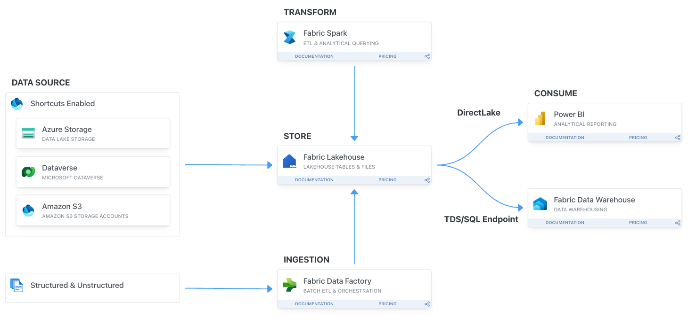

# Build Your First End to End Lakehouse Solution

Join the workshop to master building end-to-end data solutions with Microsoft Fabric. Learn to integrate, transform, and manage data in a lakehouse, utilizing Fabric pipelines, dataflows, notebooks, and Spark. Understand how BI analysts and data scientists utilize lakehouse data to enhance decision-making.

**Workshop Goals**
- Master Fabric Data Integration and Data Engineering and Data Science.
- Develop a complete data workflow: ingestion, preparation, serving, and operationalization.

**Project Context: Urban Mobility Transformation**
- Use Microsoft Fabric to analyze New York City's taxi data for improved urban planning and transportation safety.
- Aim: Better traffic forecasting, route management, and safety measures, leading to enhanced urban transport services and infrastructure.

**Lakehouse Solution Benefits**
- Unified urban transport data analysis.
- Enhanced fleet management and traffic forecasting.
- Data-driven urban development insights.
- Improved transportation reliability and safety.
- Adaptable data infrastructure for future urban mobility trends.

# Agenda

> [!TIP]
> You can progress through these exercises at your own pace. While we have structured logical breaks within the session, these are merely suggestions. You are not required to stop if you prefer to continue working. These breaks are provided to accommodate those who may need them. Feel free to continue through the material as fits your learning style and needs.

> [!IMPORTANT]
> 9:00 am - 9:30 am - [Introduction, Set Up and Overview of Fabric Analytics Platform](exercise-0-setup/start.md)
> 
> 9:30 am - 10:30 am - [Exercise 1 - Ingest data with data pipelines and shortcuts](./exercise-1/exercise-1.md) 
> 
> 10:30 am - 11:00 am - Morning Break
> 
> 11:00 am - 12:00 pm - [Exercise 2 - Transform data using Notebooks and Spark Pools](./exercise-2/exercise-2.md)
>
> 12:00 pm - 12:45 pm - Lakehouse Best Practices
> 
> 12:45 am - 2:00 pm - Lunch 60 minutes
> 
> 02:00 pm - 03:15 pm - [Exercise 3 - Generate and Serve Insights using Data Science and Power BI](./exercise-3/exercise-3.md)
> 
> 03:15 pm - 03:45 pm - Afternoon Break
> 
> 03:45 pm - 04:15 pm - [Exercise 4 - Latest Fabric Features](./exercise-4/exercise-4.md)
> 
> 04:15 pm - 05:00 pm - QnA, Recap and [Extra exercises](exercise-extra/extra.md)
>