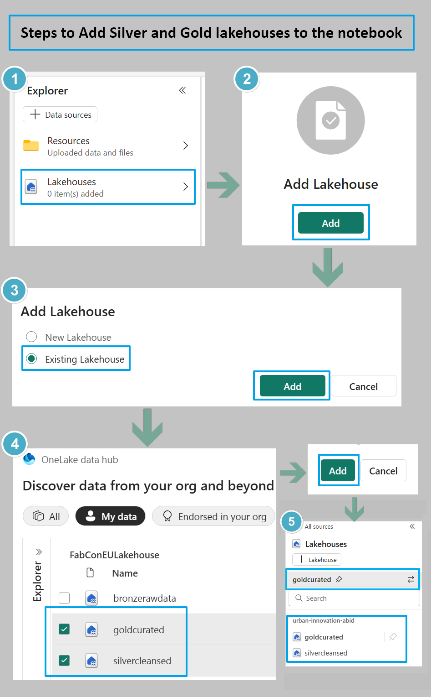

# Attach Silver and Gold Lakehouses to Exercise 3 Notebook

> [Back to Agenda](./../README.md#agenda) | [Back to Exercise 3](./../exercise-3/exercise-3.md)

This step-by-step guide will help you to connect the Silver and Gold Lakehouse created in previous exercise with the Notebook for Exercise 3 for data read and write access.

1. After importing the notebook - *Exercise 3 - Generate Insights using Data Science.ipynb* to your workspace, open the notebook artifact.
2. In the explorer pane(left) select *Lakehouses*, click on *Add* button and select *Existing Lakehouse* then click *Add*.
3. Once the *OneLake data hub* dialog box open select the silver and gold lakehouses and click the *Add* button.
4. You have successfully added the required Lakehouses to your Exercise 3 notebook. The Lakehouses would now be visible in the explorer pane in the notebook, with gold lakehouse automatically being the default one.

The steps to attach Lakehosues to the notebook can be illustrated by the below screenshot flow.

 

  
  

> [!IMPORTANT]
> Once completed, please navigate back to your Fabric workspace or to [Exercise 3 (Task 3.1)](./../exercise-3/exercise-3.md#task-31-predict-trip-duration-using-data-science-in-fabric-lakehouse).